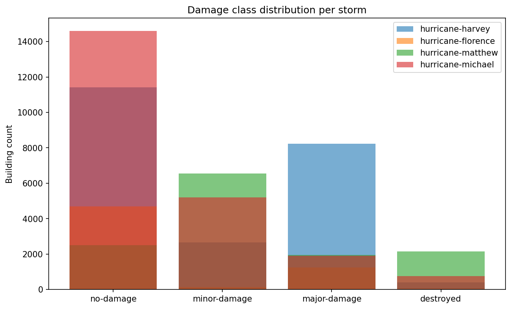
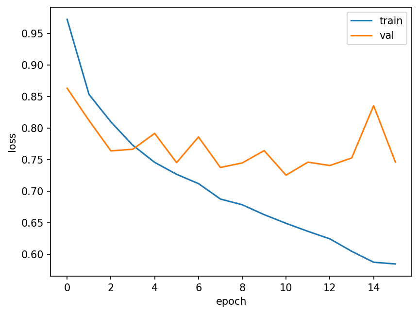
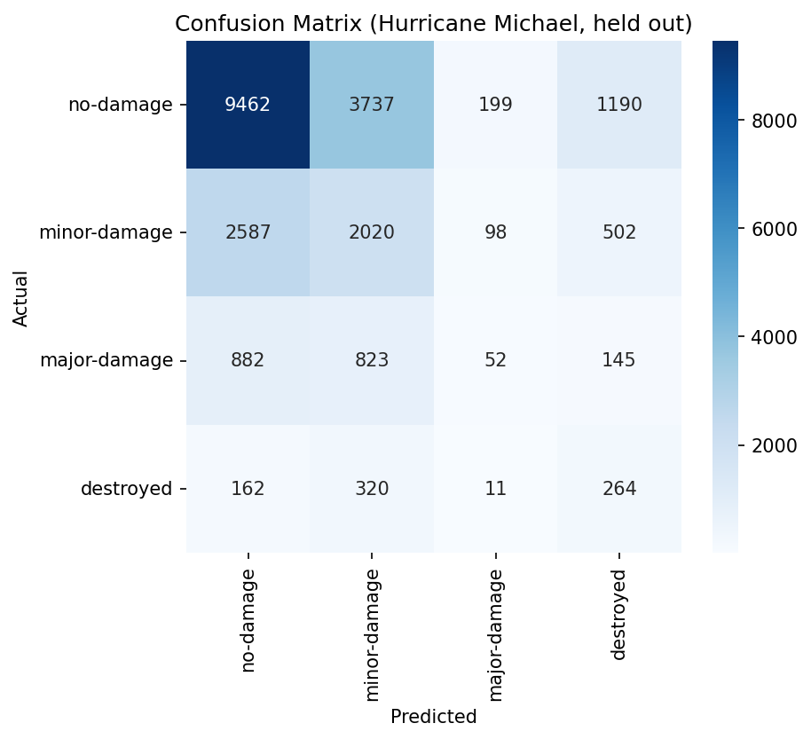
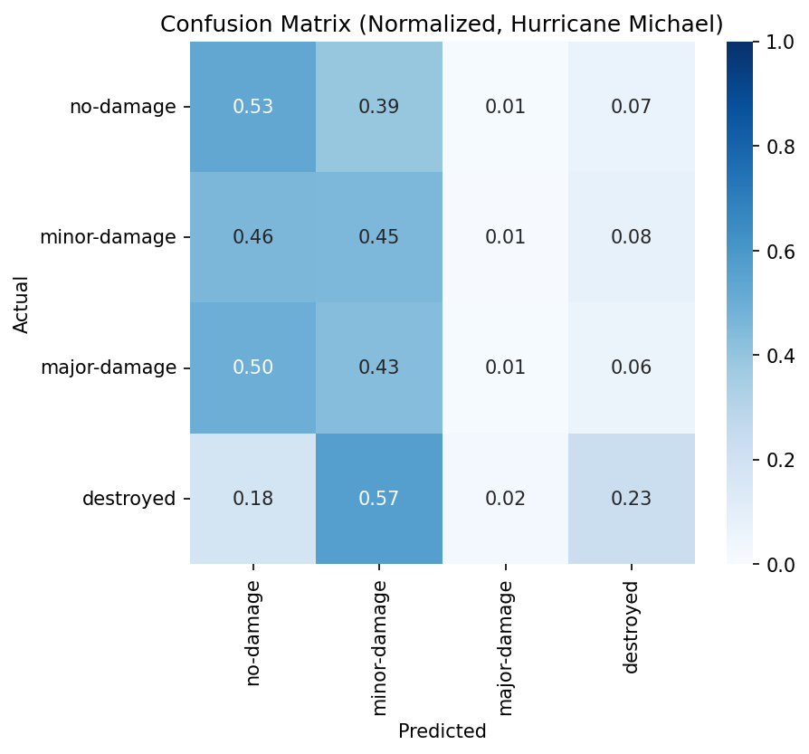
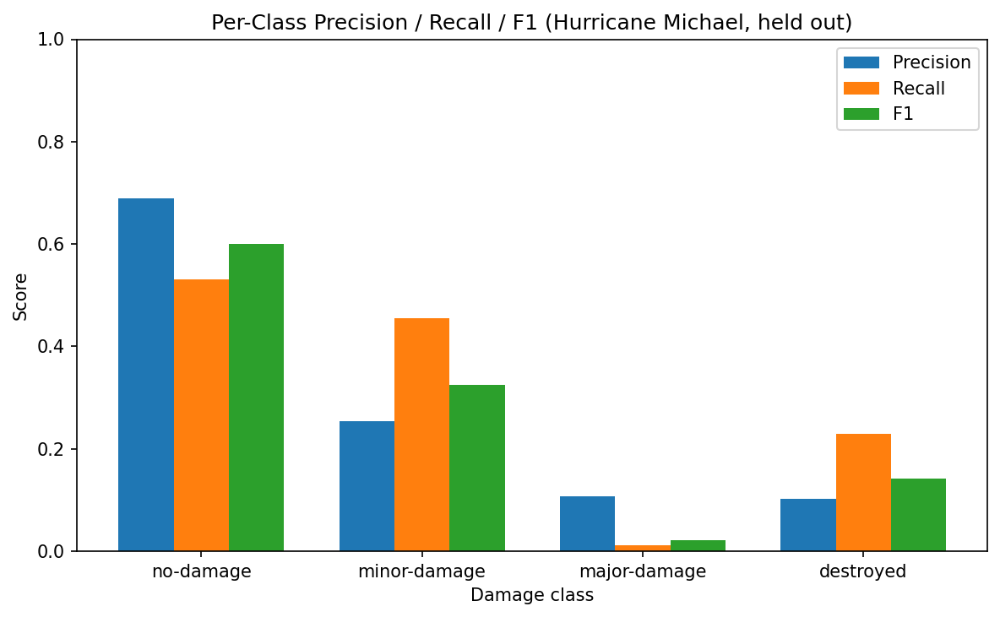
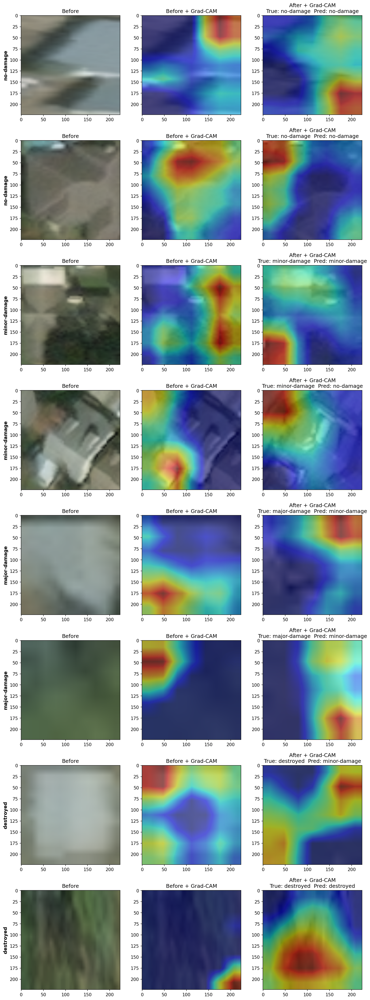

# AfterMath

**Hurricane building-damage classification from before/after satellite imagery — with Grad-CAM explainability.**


---

## How It Works

AfterMath takes a before/after satellite image pair of a single building
and predicts damage severity (`no-damage` / `minor-damage` / `major-damage`
/ `destroyed`) using a siamese dual-branch CNN: a shared, ImageNet-pretrained
ResNet18 processes the pre- and post-disaster crops separately, and their
feature vectors are concatenated before a classification head.

```
Before crop -\
              >-- shared ResNet18 --> concat features --> FC head --> damage class
After crop  -/
```

Trained on the [xBD dataset](https://xview2.org) (real hurricane
satellite imagery: Harvey, Florence, Matthew, Michael). Evaluated on
Hurricane Michael, held out entirely during training, to test
generalization to a storm the model has never seen.

---

## Results

**Macro-F1: 0.297** on the fully held-out Hurricane Michael test storm
(22,454 buildings, never seen during training).

```
              precision    recall  f1-score   support

   no-damage       0.72      0.49      0.59     14588
minor-damage       0.27      0.54      0.36      5207
major-damage       0.09      0.04      0.05      1902
   destroyed       0.14      0.29      0.19       757

    accuracy                           0.46     22454
   macro avg       0.31      0.34      0.30     22454
weighted avg       0.55      0.46      0.48     22454
```

**What this actually means:** the model does well on `no-damage` (f1 0.59,
the majority class) and does relatively well on `destroyed` (f1 0.19,
despite being the rarest class — plausibly because destroyed buildings
have the most visually distinctive before/after difference). But it has
essentially collapsed toward over-predicting `minor-damage` across the
board, which drags `major-damage` recall down to near zero (0.04) — the
model confuses `major-damage` with `minor-damage` far more often than it
correctly identifies major damage. This is explainable by (a) severe class
imbalance in training (`major-damage`/`destroyed` are minority classes in
all three training storms) and (b) genuine cross-storm domain shift
(Hurricane Michael's damage signatures were never seen in training).

For context, a trivial baseline that always predicts `no-damage` would
score macro-F1 ≈ 0.197. This model beats that floor by a real margin,
showing it learned something beyond the class prior — just not enough to
reliably separate the two more severe damage tiers. That is the model's
honest, current limitation: it's a meaningfully-better-than-baseline
damage detector, not yet a reliable damage-severity grader.

### Class Distribution



Per-storm damage class counts across the training data. `no-damage` and
`minor-damage` dominate every storm, while `major-damage` and `destroyed`
are minority classes throughout — this imbalance is the main reason the
loss function is class-weighted and macro-F1 (which weights every class
equally) is the headline metric rather than plain accuracy.

### Training Curves



### Confusion Matrix (held-out Hurricane Michael)





Raw counts (top) and row-normalized/recall view (bottom). The normalized
view makes the `major-damage` → `minor-damage` confusion visible at a
glance: most of the `major-damage` row's probability mass lands in the
`minor-damage` column instead of on the diagonal.

### Per-Class Metrics



### Grad-CAM — What Drove Each Prediction



Heatmaps are shown for both the before and after image, across all four
damage classes, with both correct and incorrect predictions included —
confirming the model is reacting to actual damage evidence in the after
image, not spurious cues (lighting, vegetation) in the before image, even
on the examples it got wrong.

### Training on Kaggle (no local GPU)

This development machine has no CUDA GPU. A CPU benchmark showed the full
training split would take many hours per epoch locally, so training was
run instead on a free Kaggle GPU kernel
([`aviamin/aftermath-full-training`](https://www.kaggle.com/code/aviamin/aftermath-full-training), GPU T4 x2)
against the same xBD data — training on the full (non-subsampled)
33,600-row train / 8,400-row validation split.

Best validation loss was **0.7801 at epoch 2**; early stopping triggered
at epoch 7 after 5 non-improving epochs. Overfitting past epoch 2 is
expected here, since this is full end-to-end fine-tuning with no frozen
layers — the committed checkpoint (`models/best.pt`, not tracked in git;
see `.gitignore`) is frozen at epoch 2's weights, not the later overfit
ones.

The raw Kaggle kernel log is archived at
[`docs/kaggle_training_log.txt`](docs/kaggle_training_log.txt) for anyone
who wants to verify the run. The training code itself
(`notebooks/03_model.ipynb`) is unchanged and portable — it can be
re-run as-is on any CUDA-capable machine to reproduce the weights; the
Kaggle kernel is simply where it was actually executed, and remains the
source of the weights behind the results above.

---

## Dataset

- **xBD** — Gupta et al., xView2 Challenge — [xview2.org](https://xview2.org)
  Real pre/post satellite imagery from ~18 disasters; this project uses
  only the four hurricane events (Harvey, Florence, Matthew, Michael).

After downloading (free registration required), place the four hurricane
events at:

```
data/raw/hurricane-harvey/
data/raw/hurricane-florence/
data/raw/hurricane-matthew/
data/raw/hurricane-michael/
```

Each event folder should contain xBD's standard `images/` and `labels/`
subfolders as provided by the download.

## Quick Start

```bash
git clone https://github.com/aviamin/aftermath.git
cd aftermath
pip install -r requirements.txt -r requirements-dev.txt
```

Download the xBD hurricane subset from xview2.org as described above.

Run the notebooks in order:

1. `01_eda.ipynb` — exploratory data analysis, class distribution
2. `02_data_prep.ipynb` — building crop extraction and pairing
3. `03_model.ipynb` — siamese model definition and training
4. `04_evaluation.ipynb` — held-out evaluation, confusion matrix, per-class metrics
5. `05_gradcam.ipynb` — Grad-CAM explainability on both branches

**Run the tests:**
```bash
pytest -v
```

---

## Tech Stack

Python · PyTorch · torchvision · scikit-learn · pandas · NumPy · OpenCV ·
Shapely · matplotlib · seaborn

---

See [`docs/superpowers/specs/2026-07-14-aftermath-design.md`](docs/superpowers/specs/2026-07-14-aftermath-design.md)
for the full design writeup (data pipeline, model architecture, training/
evaluation methodology, and testing scope).
